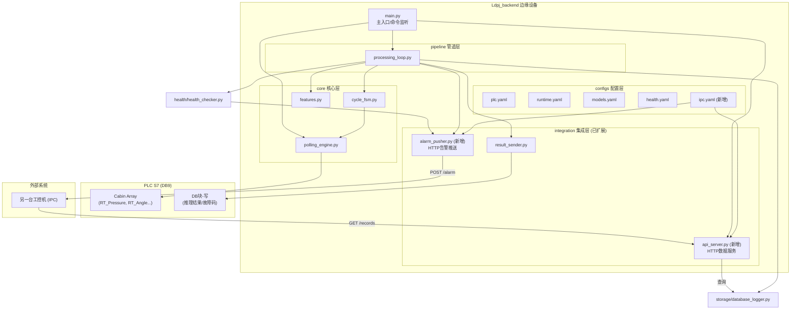
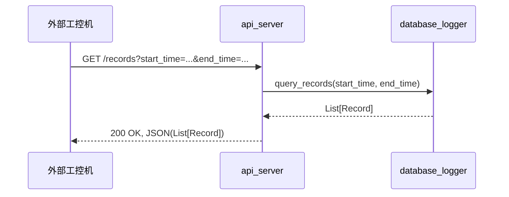
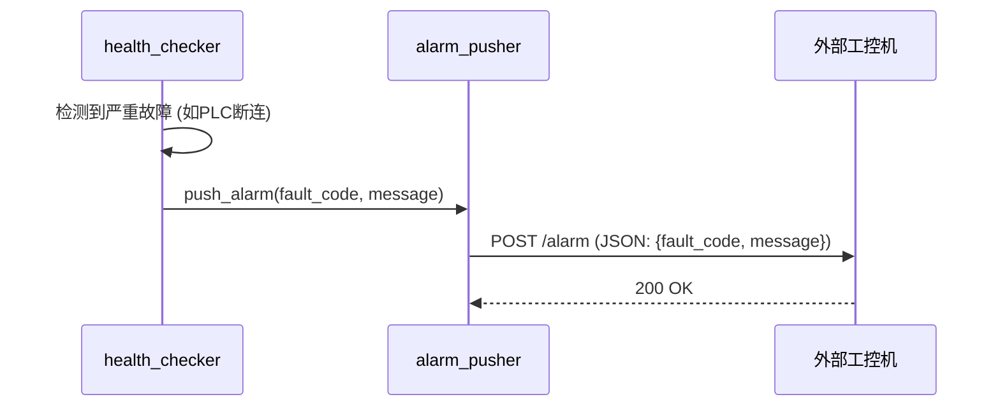

# Ldpj_backend 最终设计与开发规范

**版本**: v2.1  
**项目**: `Ldpj_backend`  
**部署环境**: Linux (推荐 Debian/Ubuntu), Python 3.11+

---

## 第零部分：模型训练、评估与部署规范

本部分定义了AI模型从训练到部署的全流程规范，是保证后端系统稳定运行的基石。

### 1. 数据集规范

- **数据来源**: 所有训练数据必须来自`Ldpj_backend`系统自身采集并存储于SQLite数据库中的历史记录。
- **数据格式**: 训练数据集应为CSV格式，包含以下标准列：
    - `id`: 记录唯一ID
    - `batch_id`: 生产批次号
    - `cavity_id`: 舱室号
    - `timestamp`: 检测开始时间戳 (ISO 8601)
    - `pressure_data`: 压力序列 (JSON格式的数组)
    - `angle_data`: 角度序列 (JSON格式的数组)
    - `label`: **人工标注的标签 (0=漏液, 1=正常)**
- **标注要求**: 必须由领域专家或通过与“黄金标准”设备（如BE原厂设备）交叉验证后进行精确标注。禁止使用无标注或弱标注数据进行最终模型训练。

### 2. 特征工程规范 (特征契约)

为保证训练和推理的一致性，所有模型必须基于以下**7维特征**进行训练。特征的计算逻辑严格遵循`lds/edge_v2/core/features.py`的实现。

| 特征名称 | 数据类型 | 描述 | 计算说明 |
| :--- | :--- | :--- | :--- |
| `max` | float | 压力序列中的最大值 | `np.max(pressures)` |
| `min` | float | 压力序列中的最小值 | `np.min(pressures)` |
| `difference` | float | 最大值与最小值的差 | `max - min` |
| `average` | float | 压力序列的平均值 | `np.mean(pressures)` |
| `variance` | float | 压力序列的方差 | `np.var(pressures)` |
| `trend_slope` | float | 压力序列的线性回归斜率 | `np.polyfit(range(len(pressures)), pressures, 1)[0]` |
| `cavity_id` | float | 舱室ID | 直接使用，转换为浮点数 |

- **特征顺序**: 输入给模型的特征向量必须严格遵循以下顺序：`['max', 'min', 'difference', 'average', 'variance', 'trend_slope', 'cavity_id']`。
- **数值精度**: 为保证跨平台一致性，`trend_slope`必须保留6位小数，其余特征保留3位小数。

### 3. 模型训练规范

- **模型选型**: **XGBoost Classifier** (`xgboost.XGBClassifier`)。
- **数据预处理**: 必须使用`sklearn.preprocessing.StandardScaler`对7维特征进行标准化处理。
- **训练脚本**: 提供标准化的训练脚本`train/train_model.py`，支持交叉验证和超参数搜索。
- **超参数建议**: 
    - `n_estimators`: 100-300
    - `max_depth`: 3-7
    - `learning_rate`: 0.05-0.2
    - `subsample`: 0.7-0.9
    - `colsample_bytree`: 0.7-0.9
- **输出产物**: 一次成功的训练必须生成一个包含以下文件的模型构件（artifacts）目录：
    1.  `xgb_model.json`: 保存为JSON格式的XGBoost Booster模型。
    2.  `xgb_scaler.joblib`: 使用`joblib`保存的`StandardScaler`对象。
    3.  `metadata.json`: 包含模型版本、训练时间、数据集、特征模式、评估指标和备注的元数据文件。
    4.  `evaluation_report.txt`: 包含混淆矩阵、分类报告（精确率、召回率、F1-score）和特征重要性排序的纯文本评估报告。

### 4. 模型评估规范

- **评估指标**: 
    - **首要指标**: **F1-Score**。在漏液检测场景中，需要同时关注精确率（避免误判）和召回率（避免漏判），F1-Score是二者的均衡评估。
    - **次要指标**: `Accuracy`, `Precision`, `Recall`, `AUC-ROC`。
- **验收标准**: 一个模型只有在独立的测试集上满足以下所有条件，才被认为是“可部署的”：
    - `F1-Score` ≥ 0.985
    - `Recall` (召回率) ≥ 0.990 (对漏液样本，即label=0)
    - `Precision` (精确率) ≥ 0.980 (对正常样本，即label=1)

### 5. 模型部署规范

- **部署流程**: 严格遵循“物理拷贝 + 脚本部署”模式。
    1.  将训练好的模型构件目录（例如 `v1.5_20260225`）完整拷贝到边缘设备的 `models/artifacts/` 目录下。
    2.  在边缘设备上执行部署脚本: `bash scripts/deploy_model.sh v1.5_20260225`。
- **部署脚本 (`deploy_model.sh`) 功能**: 
    1.  **验证构件完整性**: 检查新模型目录中4个必需文件是否存在。
    2.  **备份当前模型**: 将 `models/artifacts/current` 目录重命名为 `models/artifacts/archive/v<old_version>_<timestamp>`。
    3.  **部署新模型**: 创建一个新的 `models/artifacts/current` 目录，并将新模型文件拷贝进去。
    4.  **更新配置**: 修改 `configs/models.yaml` 文件，将 `current.version` 更新为新版本号。
    5.  **服务重启**: 提示用户手动重启后端服务以加载新模型。

--- 

## 第一部分：系统定位与设计原则 (v2.1)

### 1.1 系统定位

在v2.0（主动采集）的基础上，新增**与另一台工控机（IPC）的通讯功能**。系统不仅是一个独立的检测单元，还扮演着**数据服务端**和**告警中心**的角色，为外部系统提供数据支持和实时状态反馈。

核心任务在v2.0基础上增加：
6.  **提供数据服务**: 暴露一个轻量级的HTTP API，允许授权的工控机按条件查询历史检测数据。
7.  **主动告警推送**: 当系统发生严重故障或检测到漏液时，主动向指定的工控机地址推送告警信息。

### 1.2 设计原则

| 原则 | 说明 |
| :--- | :--- |
| **稳定优先** | 所有模块均具备异常捕获和安全降级能力，任何单一模块的故障不会导致整个系统崩溃。 |
| **故障可见** | 系统具备完善的健康自检和故障上报机制，能够主动发现并报告PLC连接异常、模型加载失败、传感器数据异常、存储空间不足等问题。 |
| **数据完整** | 每一次推理的原始数据、特征、结果和置信度都完整入库，确保数据可追溯、可导出、可用于后续离线训练。 |
| **配置驱动** | 所有硬编码参数（PLC地址、DB映射、模型路径、阈值等）全部提取到YAML配置文件中，实现配置与代码分离。 |
| **模块化** | 各模块高内聚、低耦合，可独立测试和替换。 |
| **接口标准化** | 所有对外的API和推送消息都应遵循统一、明确的JSON格式，并提供清晰的文档。 |

---

## 第二部分：系统架构总览 (v2.1)

### 2.1 架构图 (v2.1 修订版)



### 2.2 数据流 (v2.1)

数据流在v2.0基础上增加两条：

**数据查询流程**:


**告警推送流程**:


---

## 第三部分：模块详细设计 (v2.1)

(此部分内容与上一版 `Ldpj_backend_architecture_v2.1.md` 中的第三部分完全相同，此处为引用，不再重复)

---

## 第四部分：目录结构与技术栈

### 4.1 最终目录结构

```
Ldpj_backend/
├── configs/                    # 配置文件
│   ├── __init__.py
│   ├── loaders.py
│   ├── plc.yaml
│   ├── runtime.yaml
│   ├── models.yaml
│   ├── health.yaml
│   └── ipc.yaml
│
├── core/                       # 核心功能模块
│   ├── __init__.py
│   ├── polling_engine.py
│   ├── cycle_fsm.py
│   ├── features.py
│   ├── logging_setup.py
│   └── exceptions.py
│
├── models/                     # 模型管理
│   ├── __init__.py
│   ├── supervised_xgb.py
│   └── artifacts/
│       ├── current/
│       └── archive/
│
├── pipeline/                   # 业务管道
│   ├── __init__.py
│   ├── processing_loop.py
│   └── control.py
│
├── health/                     # 健康监控
│   ├── __init__.py
│   ├── health_checker.py
│   ├── fault_reporter.py
│   └── fault_codes.py
│
├── storage/                    # 数据存储
│   ├── __init__.py
│   ├── database_logger.py
│   └── data_exporter.py
│
├── integration/                # 外部集成
│   ├── __init__.py
│   ├── result_sender.py
│   ├── api_server.py
│   └── alarm_pusher.py
│
├── tests/                      # 测试套件
│   ├── __init__.py
│   ├── ... (各模块的测试文件)
│   └── conftest.py
│
├── train/                      # 模型训练
│   ├── __init__.py
│   ├── train_model.py
│   └── evaluate_model.py
│
├── scripts/                    # 运维脚本
│   ├── install.sh
│   ├── install.ps1
│   └── deploy_model.sh
│
├── main.py                     # 主入口
├── requirements.txt            # Python依赖
└── README.md                   # 项目说明
```

### 4.2 技术栈

| 组件 | 技术选型 | 版本要求 |
| :--- | :--- | :--- |
| 编程语言 | Python | 3.11+ |
| ML框架 | XGBoost | ≥ 1.7 |
| 数据预处理 | scikit-learn | ≥ 1.2 |
| PLC通信 | python-snap7 | ≥ 1.0 |
| 数据库 | SQLite3 | (内置) |
| 配置管理 | PyYAML | ≥ 6.0 |
| 数据处理 | pandas, numpy | ≥ 2.0, ≥ 1.24 |
| API框架 | FastAPI | ≥ 0.95 |
| Web服务器 | Uvicorn | ≥ 0.20 |
| 测试框架 | pytest | ≥ 7.0 |
| 异步框架 | asyncio | (内置) |

---

## 第五部分：开发与交付计划

开发工作将严格按照本设计文档进行，并在`xiaofinesh/Ldpj_backend`仓库中提交代码。

**开发阶段划分:**

1.  **阶段一：基础框架搭建 (预计3天)**
    -   初始化项目目录结构。
    -   完成所有`configs/*.yaml`的定义。
    -   实现`core/logging_setup.py`和`core/exceptions.py`。
2.  **阶段二：核心功能开发 (预计5天)**
    -   开发`core/polling_engine.py`并进行mock测试。
    -   开发`core/cycle_fsm.py`并进行单元测试。
    -   开发`pipeline/processing_loop.py`，整合核心流程。
3.  **阶段三：模型与存储集成 (预计3天)**
    -   集成`models/supervised_xgb.py`。
    -   开发`storage/database_logger.py`和`storage/data_exporter.py`。
4.  **阶段四：外部集成与健康监控 (预计4天)**
    -   开发`integration/api_server.py`和`integration/alarm_pusher.py`。
    -   开发完整的`health`模块。
5.  **阶段五：测试与文档完善 (预计3天)**
    -   编写完整的单元测试和集成测试。
    -   撰写`README.md`和部署手册。

**最终交付物:**

-   `Ldpj_backend`仓库中完整、可运行的Python项目代码。
-   详细的`README.md`，包含安装、配置、运行和部署说明。
-   一套完整的模型训练与评估脚本 (`train/`目录)。
-   一套运维脚本，用于简化安装和模型部署 (`scripts/`目录)。
