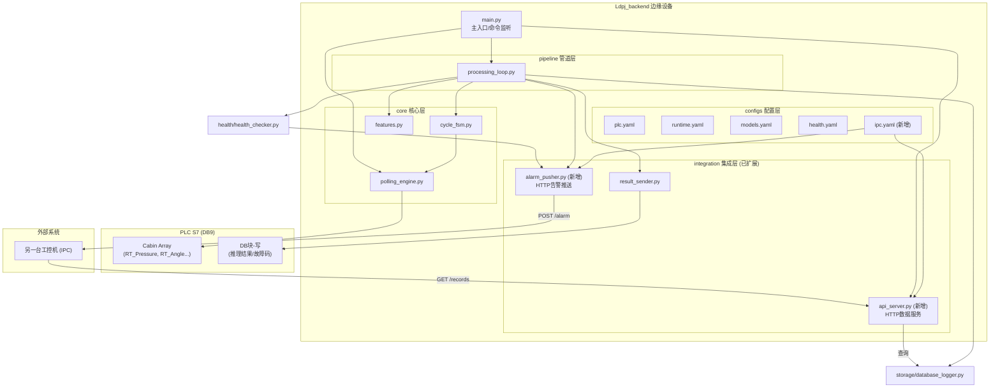
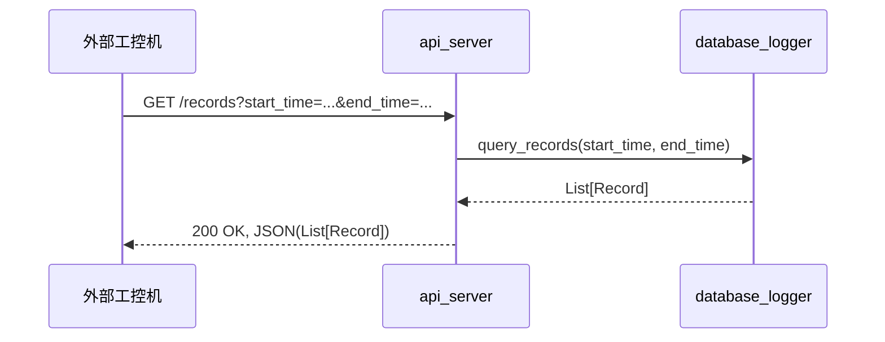
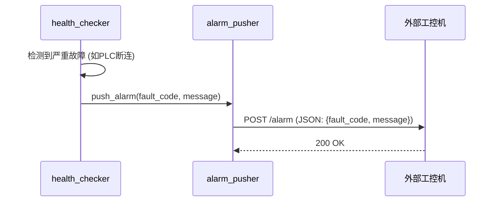

# Ldpj_backend 后端系统架构设计文档

**版本**: v2.1 (在v2.0基础上增加工控机通讯)  
**基于**: `lds/edge_v2` 模块化框架，并根据 `DB_Global [DB9]` 实际数据结构进行重构  
**定位**: 部署于边缘设备（树莓派5）的**实时高频数据采集**、AI漏液检测与**外部系统集成**的后端系统

---

## 一、系统定位与设计原则 (v2.1)

### 1.1 系统定位

在v2.0（主动采集）的基础上，新增**与另一台工控机（IPC）的通讯功能**。系统不仅是一个独立的检测单元，还扮演着**数据服务端**和**告警中心**的角色，为外部系统提供数据支持和实时状态反馈。

核心任务在v2.0基础上增加：
6.  **提供数据服务**: 暴露一个轻量级的HTTP API，允许授权的工控机按条件查询历史检测数据。
7.  **主动告警推送**: 当系统发生严重故障或检测到漏液时，主动向指定的工控机地址推送告警信息。

### 1.2 设计原则

新增**接口标准化**原则：所有对外的API和推送消息都应遵循统一、明确的JSON格式，并提供清晰的文档。

---

## 二、系统架构总览 (v2.1)

### 2.1 架构图 (v2.1 修订版)



### 2.2 数据流 (v2.1)

数据流在v2.0基础上增加两条：

**数据查询流程**:


**告警推送流程**:


---

## 三、模块详细设计 (v2.1 修订)

### 3.1 新增模块：`integration` 层扩展

#### 3.1.1 `integration/api_server.py` (新增)

- **职责**: 启动一个轻量级的HTTP服务器（如`FastAPI`或`Flask`），为外部系统提供一个RESTful API来查询存储在本地SQLite数据库中的历史数据。
- **技术选型**: **FastAPI**。因为它性能高、自带Swagger UI文档、支持异步，非常适合此类应用。
- **API端点 (Endpoints)**:
    -   `GET /records`: 查询检测记录。
        -   **查询参数**: `start_time` (ISO 8601), `end_time` (ISO 8601), `cavity_id` (int), `result` (0 or 1), `limit` (int, default 100)。
        -   **成功响应**: `200 OK`，返回一个包含记录对象的JSON数组。
        -   **失败响应**: `400 Bad Request` (参数错误), `500 Internal Server Error`。
    -   `GET /status`: 获取系统当前状态。
        -   **响应**: `200 OK`，返回JSON对象，包含模型版本、PLC连接状态、总记录数、最近一次心跳等。
    -   `GET /health`: 获取详细健康报告。
        -   **响应**: `200 OK`，返回 `health_checker` 生成的完整健康报告。
- **安全性**: API服务器应支持配置一个API密钥（`X-API-Key` 头），只有持有正确密钥的客户端才能访问。

#### 3.1.2 `integration/alarm_pusher.py` (新增)

- **职责**: 提供一个统一的函数，用于向配置好的外部工控机地址主动推送HTTP POST告警消息。
- **功能**:
    -   `push_alarm(fault_code: str, message: str, level: str)`: 发送结构化的告警信息。
    -   支持配置多个推送目标地址。
    -   内置重试逻辑（例如，推送失败后重试3次）。
    -   异步发送，避免阻塞主处理循环或健康检查线程。
- **触发点**:
    -   `health_checker.py`: 当检测到严重故障时调用 `push_alarm`。
    -   `processing_loop.py`: 当检测到漏液结果时，根据配置决定是否调用 `push_alarm`。

### 3.2 配置更新 (`configs/ipc.yaml`)

#### 3.2.1 `configs/ipc.yaml` (新增)

```yaml
api_server:
  enabled: true
  host: "0.0.0.0"
  port: 8000
  api_key: "your-secret-api-key"  # 用于验证客户端身份

alarm_pusher:
  enabled: true
  targets:
    - url: "http://192.168.0.20:9000/api/alarm"
      timeout_s: 5
      retries: 3
  push_on_leak: false # 是否在检测到漏液时也推送告警
  min_fault_level_to_push: "ERROR" # 推送告警的最低故障级别 (INFO, WARNING, ERROR, CRITICAL)
```

### 3.3 其他模块的适应性调整

- **`main.py`**: 启动时，根据配置决定是否启动 `api_server` 的HTTP服务线程。
- **`health/health_checker.py`**: 在检测到故障后，调用 `alarm_pusher.push_alarm`。
- **`pipeline/processing_loop.py`**: 在处理完一次推理后，如果结果是漏液且 `ipc.yaml` 中 `push_on_leak` 为 `true`，则调用 `alarm_pusher`。
- **`requirements.txt`**: 新增 `fastapi` 和 `uvicorn` 依赖。

---

## 四、与 v2.0 架构的对比

| 维度 | v2.0 架构 | v2.1 架构 |
| :--- | :--- | :--- |
| **系统边界** | 封闭系统，仅与PLC交互 | **开放系统**，与PLC和外部IPC交互 |
| **集成方式** | 仅PLC DB读写 | PLC DB读写 + **HTTP API服务** + **HTTP告警推送** |
| **核心模块** | Polling, FSM, Processing | 保持不变 |
| **新增模块** | 无 | **api_server.py**, **alarm_pusher.py** |
| **配置** | 4个YAML文件 | 5个YAML文件 (新增 `ipc.yaml`) |
| **依赖** | snap7, xgboost, ... | 新增 `fastapi`, `uvicorn` |
| **角色** | 实时分析单元 | 实时分析单元 + **数据中心** + **告警中心** |

---

## 五、结论 (v2.1)

架构v2.1在v2.0的基础上，通过增加一个轻量级的`integration`层，成功地将一个独立的边缘计算节点转变为一个具备**服务能力的网络化节点**。这种扩展具有以下优势：

- **数据价值最大化**: 存储在本地的数据不再是孤岛，可以通过API被其他系统（如中央服务器、MES、数据分析平台）利用。
- **实时响应能力**: 主动推送告警的能力使得系统能够更及时地通知操作人员或上层系统，实现了更高级别的自动化集成。
- **低耦合扩展**: 新增的通讯功能被严格限制在`integration`层，与核心的采集和推理逻辑完全解耦，保证了系统的稳定性和可维护性。

此版本的设计满足了现代工业物联网（IIoT）对边缘设备的基本要求：既能自主完成本地任务，又能作为网络中的一员进行数据共享和协同工作。
